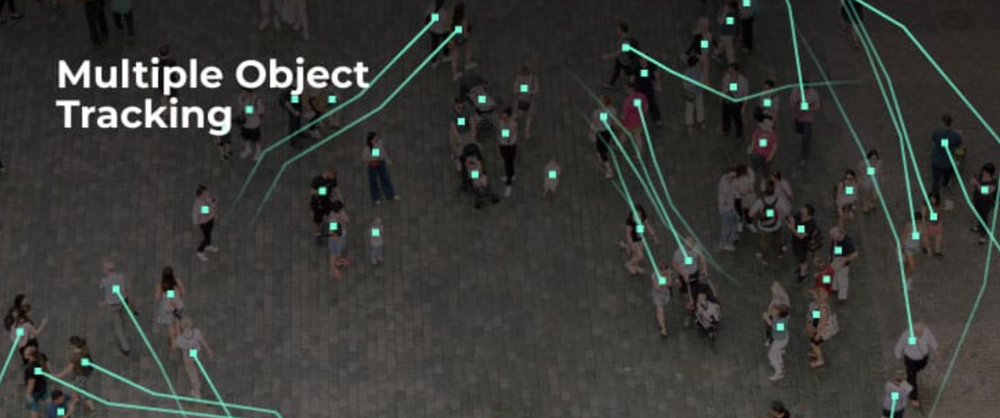

# MOT

## A collection of the latest state-of-the-art MOT (Multiple Object Tracking) papers with code implementations.  

### The table below contains top 50 most recent MOT papers submitted to one of the top 10 rated conferences below.

* [The IEEE/CVF Conference on Computer Vision and Pattern Recognition (CVPR)](https://cvpr.thecvf.com/)
* [IEEE/CVF International Conference on Computer Vision (ICCV)](https://iccv2023.thecvf.com/)
* [International Conference on Machine Learning (ICML)](https://icml.cc/)
* [European Conference on Computer Vision (ECCV)](https://eccv2022.ecva.net/) 
* [British Machine Vision Conference (BMVC)](https://bmvc2023.org/)
* [IEEE/CVF Conference on Computer Vision and Pattern Recognition Workshops (CVPRW)](https://www.computer.org/csdl/proceedings/cvprw/2022/1G55WEFExd6)
* [IEEE/CVF Winter Conference on Applications of Computer Vision (WACV)](https://wacv2024.thecvf.com/)
* [IEEE/CVF International Conference on Computer Vision Workshops (ICCVW)](https://www.computer.org/csdl/proceedings/1800041)
* [IEEE International Conference on Image Processing (ICIP)](https://2023.ieeeicip.org/)
* [Asian Conference on Computer Vision (ACCV)](https://www.accv2022.org/en/)

|Title                                                                                                                                                                              |Implementation                                                                                                                    |Published |Conference/Journal|
|-----------------------------------------------------------------------------------------------------------------------------------------------------------------------------------|----------------------------------------------------------------------------------------------------------------------------------|----------|------------------|
|<a target="_blank" href="http://arxiv.org/pdf/2309.00233v2">Object-Centric Multiple Object Tracking</a>                                                                            |<a target="_blank" href="https://github.com/amazon-science/object-centric-multiple-object-tracking">CODE</a>                      |2023-09-01|ICCV              |
|<a target="_blank" href="http://arxiv.org/pdf/2308.13229v1">ReST: A Reconfigurable Spatial-Temporal Graph Model for Multi-Camera Multi-Object Tracking</a>                         |<a target="_blank" href="https://github.com/chengche6230/rest">CODE</a>                                                           |2023-08-25|ICCV              |
|<a target="_blank" href="http://arxiv.org/pdf/2308.11607v1">Delving into Motion-Aware Matching for Monocular 3D Object Tracking</a>                                                |<a target="_blank" href="https://github.com/kuanchihhuang/moma-m3t">CODE</a>                                                      |2023-08-22|ICCV              |
|<a target="_blank" href="http://arxiv.org/pdf/2308.06635v1">3DMOTFormer: Graph Transformer for Online 3D Multi-Object Tracking</a>                                                 |<a target="_blank" href="https://github.com/dsx0511/3dmotformer">CODE</a>                                                         |2023-08-12|ICCV              |
|<a target="_blank" href="http://arxiv.org/pdf/2307.15700v2">MeMOTR: Long-Term Memory-Augmented Transformer for Multi-Object Tracking</a>                                           |<a target="_blank" href="https://github.com/mcg-nju/memotr">CODE</a>                                                              |2023-07-28|ICCV              |
|<a target="_blank" href="http://arxiv.org/pdf/2306.05888v2">TrajectoryFormer: 3D Object Tracking Transformer with Predictive Trajectory Hypotheses</a>                             |<a target="_blank" href="https://github.com/poodarchu/efg">CODE</a>                                                               |2023-06-09|ICCV              |
|<a target="_blank" href="http://arxiv.org/pdf/2202.11983v1">GIAOTracker: A comprehensive framework for MCMOT with global information and optimizing strategies in VisDrone 2021</a>|<a target="_blank" href="https://github.com/dyhBUPT/GIAOTracker">CODE</a>                                                         |2022-02-24|ICCV              |
|<a target="_blank" href="http://arxiv.org/pdf/2303.17228v1">Streaming Video Model</a>                                                                                              |<a target="_blank" href="https://github.com/yuzhms/streaming-video-model">CODE</a>                                                |2023-03-30|CVPR              |
|<a target="_blank" href="http://arxiv.org/pdf/2303.15904v1">Mask-Free Video Instance Segmentation</a>                                                                              |<a target="_blank" href="https://github.com/syscv/maskfreevis">CODE</a>                                                           |2023-03-28|CVPR              |
|<a target="_blank" href="http://arxiv.org/pdf/2302.03802v2">Standing Between Past and Future: Spatio-Temporal Modeling for Multi-Camera 3D Multi-Object Tracking</a>               |<a target="_blank" href="https://github.com/tri-ml/pf-track">CODE</a>                                                             |2023-02-07|CVPR              |
|<a target="_blank" href="http://arxiv.org/pdf/2212.03038v2">Unifying Short and Long-Term Tracking with Graph Hierarchies</a>                                                       |<a target="_blank" href="https://github.com/dvl-tum/SUSHI">CODE</a>                                                               |2022-12-06|CVPR              |
|<a target="_blank" href="http://arxiv.org/pdf/2211.09791v2">MOTRv2: Bootstrapping End-to-End Multi-Object Tracking by Pretrained Object Detectors</a>                              |<a target="_blank" href="https://github.com/DanceTrack/DanceTrack">CODE</a>                                                       |2022-11-17|CVPR              |
|<a target="_blank" href="http://arxiv.org/pdf/2211.06894v1">Learning from partially labeled data for multi-organ and tumor segmentation</a>                                        |<a target="_blank" href="https://github.com/jianpengz/DoDNet">CODE</a>                                                            |2022-11-13|CVPR              |
|<a target="_blank" href="http://arxiv.org/pdf/2208.04438v2">Occlusion-Aware Instance Segmentation via BiLayer Network Architectures</a>                                            |<a target="_blank" href="https://github.com/lkeab/BCNet">CODE</a>                                                                 |2022-08-08|CVPR              |
|<a target="_blank" href="http://arxiv.org/pdf/2203.15175v2">Unified Transformer Tracker for Object Tracking</a>                                                                    |<a target="_blank" href="https://github.com/flowerfan/trackron">CODE</a>                                                          |2022-03-29|CVPR              |
|<a target="_blank" href="http://arxiv.org/pdf/2203.14360v3">Observation-Centric SORT: Rethinking SORT for Robust Multi-Object Tracking</a>                                         |<a target="_blank" href="https://github.com/PaddlePaddle/PaddleDetection">CODE</a>                                                |2022-03-27|CVPR              |
|<a target="_blank" href="http://arxiv.org/pdf/2203.12335v2">DR.VIC: Decomposition and Reasoning for Video Individual Counting</a>                                                  |<a target="_blank" href="https://github.com/taohan10200/drnet">CODE</a>                                                           |2022-03-23|CVPR              |
|<a target="_blank" href="http://arxiv.org/pdf/2106.06856v1">DyGLIP: A Dynamic Graph Model with Link Prediction for Accurate Multi-Camera Multiple Object Tracking</a>              |<a target="_blank" href="https://github.com/uark-cviu/DyGLIP">CODE</a>                                                            |2021-06-12|CVPR              |
|<a target="_blank" href="http://arxiv.org/pdf/2212.14750v2">Unsupervised 4D LiDAR Moving Object Segmentation in Stationary Settings with Multivariate Occupancy Time Series</a>    |<a target="_blank" href="https://github.com/thkreutz/umosmots">CODE</a>                                                           |2022-12-30|WACV              |
|<a target="_blank" href="http://arxiv.org/pdf/2212.03586v1">Multiple Object Tracking Challenge Technical Report for Team MT_IoT</a>                                                |<a target="_blank" href="https://github.com/BingfengYan/DS_OCSORT">CODE</a>                                                       |2022-12-07|ECCV              |
|<a target="_blank" href="http://arxiv.org/pdf/2207.14012v1">Video Mask Transfiner for High-Quality Video Instance Segmentation</a>                                                 |<a target="_blank" href="https://github.com/SysCV/vmt">CODE</a>                                                                   |2022-07-28|ECCV              |
|<a target="_blank" href="http://arxiv.org/pdf/2207.12978v1">Tracking Every Thing in the Wild</a>                                                                                   |<a target="_blank" href="https://github.com/SysCV/tet">CODE</a>                                                                   |2022-07-26|ECCV              |
|<a target="_blank" href="http://arxiv.org/pdf/2207.09295v1">The Caltech Fish Counting Dataset: A Benchmark for Multiple-Object Tracking and Counting</a>                           |<a target="_blank" href="https://github.com/visipedia/caltech-fish-counting">CODE</a>                                             |2022-07-19|ECCV              |
|<a target="_blank" href="http://arxiv.org/pdf/2207.07078v4">Towards Grand Unification of Object Tracking</a>                                                                       |<a target="_blank" href="https://github.com/masterbin-iiau/unicorn">CODE</a>                                                      |2022-07-14|ECCV              |
|<a target="_blank" href="http://arxiv.org/pdf/2207.05518v2">Tracking Objects as Pixel-wise Distributions</a>                                                                       |<a target="_blank" href="https://github.com/dvlab-research/eccv22-p3aformer-tracking-objects-as-pixel-wise-distributions">CODE</a>|2022-07-12|ECCV              |
|<a target="_blank" href="http://arxiv.org/pdf/2210.16572v1">SearchTrack: Multiple Object Tracking with Object-Customized Search and Motion-Aware Features</a>                      |<a target="_blank" href="https://github.com/qa276390/searchtrack">CODE</a>                                                        |2022-10-29|BMVC              |
|<a target="_blank" href="http://arxiv.org/pdf/2210.03355v1">Multiple Object Tracking from appearance by hierarchically clustering tracklets</a>                                    |<a target="_blank" href="https://github.com/nii-satoh-lab/mot_fcg">CODE</a>                                                       |2022-10-07|BMVC              |

### The table below contains 50 most recent MOT papers from other conferences/journals.
